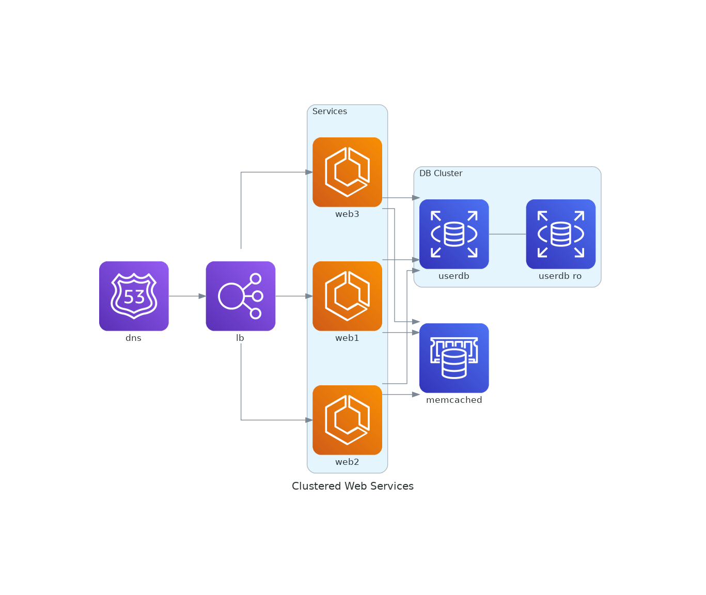

# Diagrams

Diagrams は、Pythonで図やダイアグラムを簡単に作成するためのツールである。特に、アーキテクチャの図やインフラストラクチャのダイアグラムをコードで作成するので、バージョン管理が容易である。

## Getting started
**実行**
Pythonの実行環境をコンテナ化しているので、下のコマンドを実行する。
```bash
docker compose up -d
```

## Example
Diagramsを用いて簡単な図を作成してみる。

**例１**

```py
# grouped_workers.py
from diagrams import Diagram
from diagrams.aws.compute import EC2
from diagrams.aws.database import RDS
from diagrams.aws.network import ELB

with Diagram("Grouped Workers", show=False, direction="TB"):
    ELB("lb") >> [EC2("worker1"),
                  EC2("worker2"),
                  EC2("worker3"),
                  EC2("worker4"),
                  EC2("worker5")] >> RDS("events")
```

| ELBが5つのEC2インスタンスにトラフィックを分配し、それらのEC2インスタンスがRDSにデータを保存するアーキテクチャ図 |
| -- |
|  |


**例２**

```py
# clustered_web_services.py
from diagrams import Cluster, Diagram
from diagrams.aws.compute import ECS
from diagrams.aws.database import ElastiCache, RDS
from diagrams.aws.network import ELB
from diagrams.aws.network import Route53

with Diagram("Clustered Web Services", show=False):
    dns = Route53("dns")
    lb = ELB("lb")

    with Cluster("Services"):
        svc_group = [ECS("web1"),
                     ECS("web2"),
                     ECS("web3")]

    with Cluster("DB Cluster"):
        db_primary = RDS("userdb")
        db_primary - [RDS("userdb ro")]

    memcached = ElastiCache("memcached")

    dns >> lb >> svc_group
    svc_group >> db_primary
    svc_group >> memcached
```

| 複数のサービスによるクラスターのアーキテクチャ図 |
| -- |
|  |


その他の例は[Diagrams docs example](https://diagrams.mingrammer.com/docs/getting-started/examples)に紹介されている。


## Ref
[Diagrams GitHub page](https://github.com/mingrammer/diagrams)